<div align="center">
🎹 RAMP
Roblox Auto MIDI Player
The most advanced auto player of 2026.
Human-like auto playing · live MIDI keyboard · black-MIDI visualizer · AI audio→MIDI · letter sheets · full theming — one portable app.
<br>
-6366f1?style=for-the-badge&logo=windows&logoColor=white)


<br>
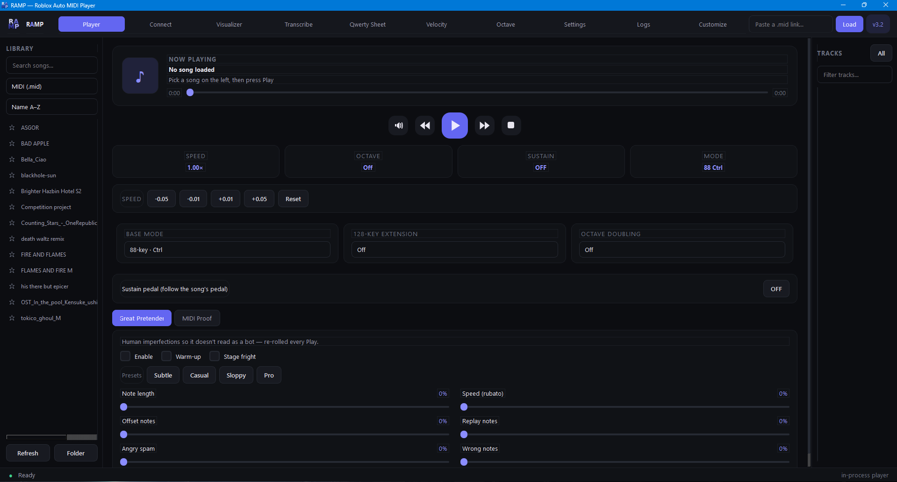
</div>
> Not affiliated with or endorsed by Roblox Corporation. Use responsibly and follow the rules of any experience you play in.
---
⚡ Why RAMP
	
🎭 Plays like a human	Warm-up, stage fright, rubato, drifting note lengths — even wrong notes on demand. Re-rolled every play so it never sounds scripted.
🌩️ Black-MIDI proof	Renders 10,000+ notes per second at a locked 60 fps, with an audio engine that never chokes or rubber-bands.
🤖 AI transcription built in	Three models turn any MP3 or link into playable MIDI — in the cloud with zero setup, or free and unlimited on your own PC.
🎛️ Full dynamics engine	Auto-volume, 128-level velocity keybinds, dynamics curves, song analysis, auto velocity from note density.
🖱️ Never interrupts Roblox	Overlay mode + global hotkeys: control everything without Roblox ever losing focus.
📦 Zero setup	Extract, run `RAMP.exe`. Portable, self-updating, sound out of the box.
---
⬇️ Download
Get the latest RAMP_release.zip →
Extract anywhere → run `RAMP.exe`. That's the whole install.
	
OS	Windows 10 / Windows 11 (64-bit)
Install	None — portable folder, settings live in `%APPDATA%\RAMP`
Internet	Only for Cloud transcription, `.mid` links, and updates — playing is fully offline
Sound out of the box	Yes — Microsoft GS Wavetable Synth, or load any `.sf2` / `.sfz` soundfont
Updates	Automatic — RAMP offers new versions from this page at launch
Not supported	macOS / Linux (RAMP sends Windows keystrokes)
> **Windows Defender note:** RAMP sends keystrokes — that's literally its job — which some machines flag as a false positive. If the exe vanishes on first run: Windows Security → Protection history → Restore, then add the RAMP folder as an exclusion. Or build it yourself from this source with `build_exe.bat` — then there's nothing to trust but your own build.
---
🎹 Auto player
The core: load any `.mid`, press play, and RAMP performs it on any Roblox piano — 61-key, 88-key Transpose, or 88-key Ctrl, with a 128-key extension for the monsters.
Speed control, seeking, playlists with auto-next & loop, sustain pedal following, per-track muting
Global hotkeys — play / pause / stop / speed / panic without ever leaving Roblox
Overlay mode — clicking RAMP's buttons doesn't steal focus, so the music never stutters while you tweak mid-song
Bounded catch-up timing keeps the rhythm perfect through lag spikes instead of rubber-banding
Favourites — star your best MIDIs and sort them straight to the top
<div align="center">
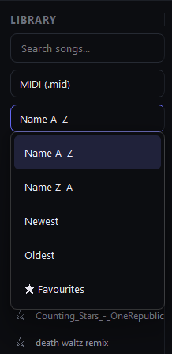
</div>
🎭 Great Pretender
Human imperfections so it doesn't read as a bot — re-rolled on every single play. Warm-up, stage fright, note-length drift, offsets, rubato, replayed notes, angry spam, wrong notes. Four presets from Subtle to Pro, or dial in your own blend.
🏆 MIDI Proof
<div align="center">
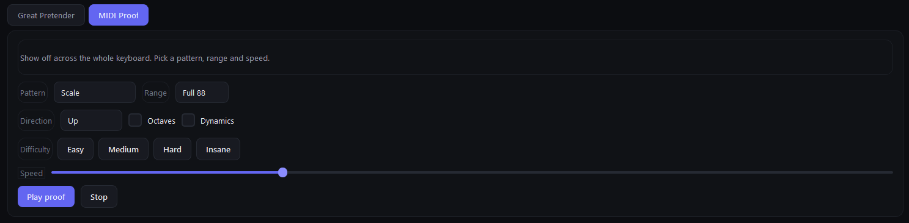
</div>
Show off across the whole keyboard on command: scales and patterns over any range, up to Insane difficulty, with octaves and dynamics — live proof you're "really playing".
---
🌈 Visualizer
<div align="center">
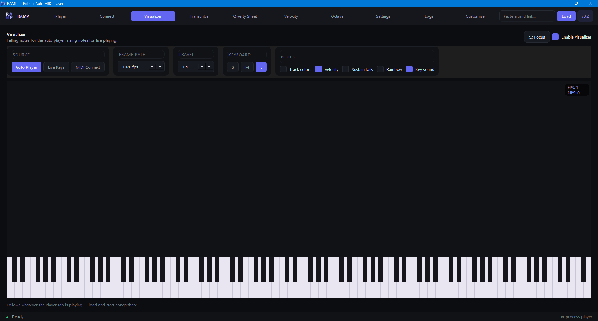
</div>
A full Synthesia-style engine living inside the app:
Three sources — the auto player, Live Keys (every VP keypress on your PC), or a connected MIDI keyboard
Track colors, velocity shading, sustain tails, Rainbow mode, key sound for live typing
Live FPS / NPS counters, frame rate up to 2500 fps, note travel speed, S/M/L keyboard, Focus mode for a clean full-window view
Engineered for black MIDI: 10,000+ notes per second at a locked 60 fps
---
🤖 Audio → MIDI
<div align="center">
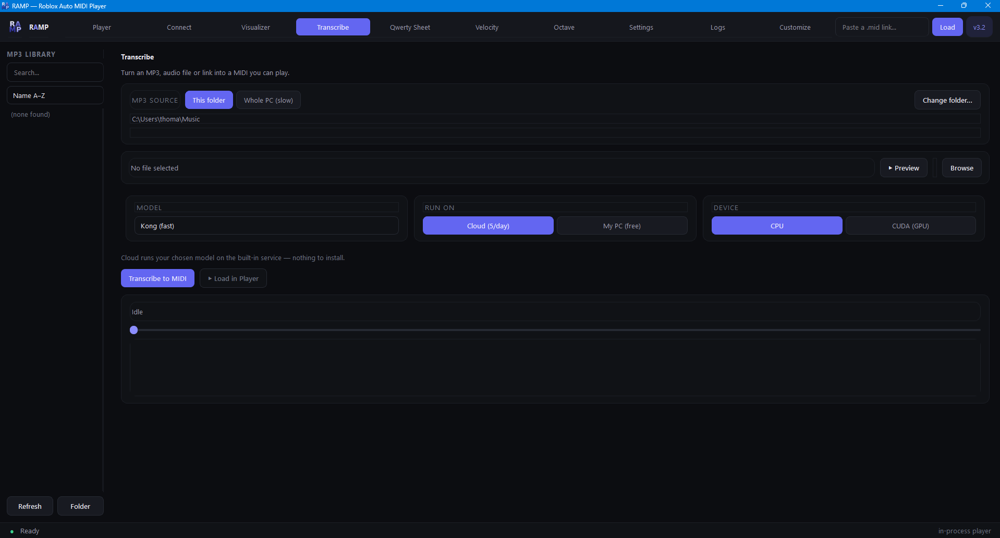
</div>
Turn an MP3, any audio file, or a link into a MIDI you can play.
<div align="center">
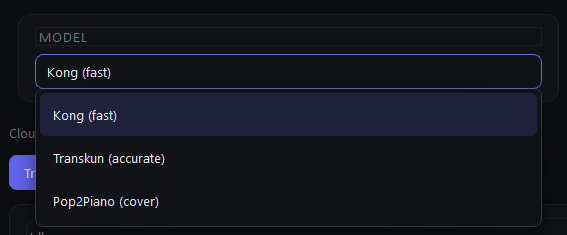
</div>
Three AI models — Kong (fast), Transkun (accurate), Pop2Piano (cover-style)
Cloud — zero setup; uploads straight to the service with live progress and pre-warms the GPU while you're still picking a file
My PC — free and unlimited; one-click model install, CPU or CUDA
Preview the audio first to make sure it's the right file
Results land in your midi folder with one-click Load in Player
---
🎛️ Velocity & dynamics
<div align="center">
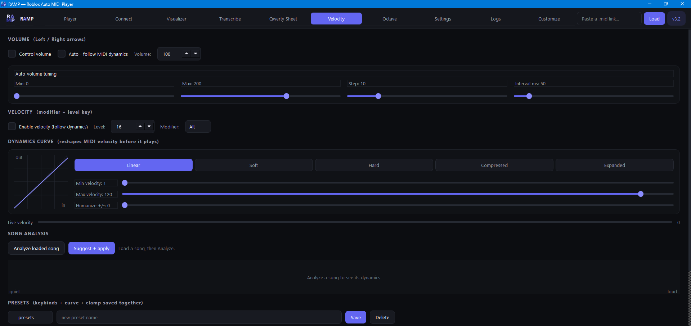
</div>
Auto-volume that follows the MIDI's dynamics, fully tunable
Dynamics curves — Linear / Soft / Hard / Compressed / Expanded with clamps and humanize
Song analysis — analyze a loaded song and auto-apply suggested settings
Auto velocity — shapes dynamics from note density: quiet in calm passages, swelling through rapid runs (brilliant for flat-velocity MIDIs)
Full velocity keybind grid up to all 128 levels, with savable presets
<div align="center">
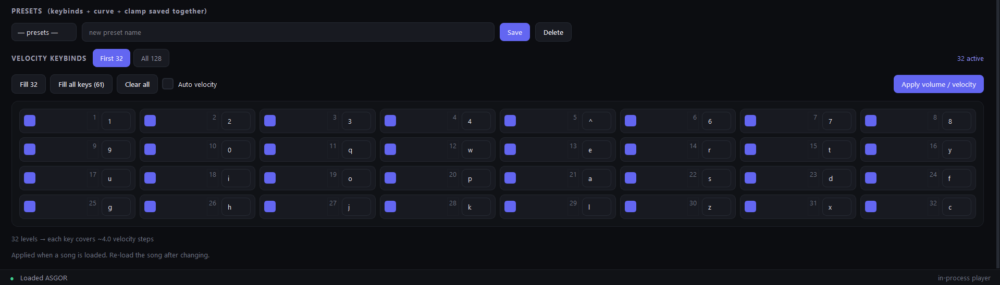
</div>
---
🎚️ Octave doubling
<div align="center">
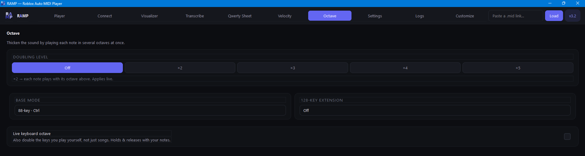
</div>
Thicken the sound by playing every note in up to ×5 octaves at once — applies live, works on songs and your own playing.
---
🔌 Live MIDI keyboard
<div align="center">
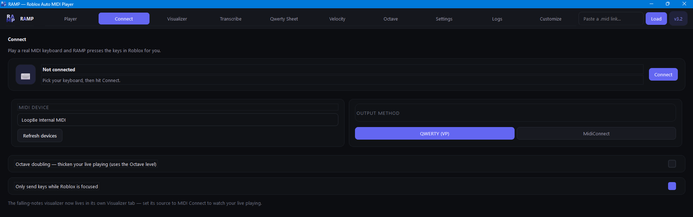
</div>
Plug in a real MIDI keyboard and RAMP presses the keys in Roblox for you — QWERTY (VP) or MidiConnect numpad output, live velocity, sustain, octave doubling, and the visualizer follows along.
---
📜 Qwerty sheets
Turn any MIDI into letter-note sheets with playability levels and automatic octave shifting.
---
⚙️ Settings & sound
<div align="center">
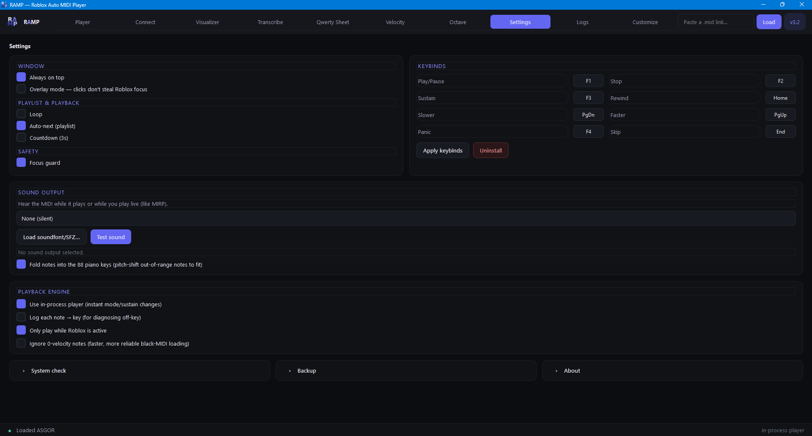
</div>
Hear the MIDI as it plays — built-in SFZ sampler, any `.sf2` soundfont (FluidSynth), or a MIDI device (VirtualMIDISynth / OmniMIDI / GS Wavetable). Rebindable hotkeys, focus guard, playback engine options, backup & restore, system check.
🎨 Customize
<div align="center">
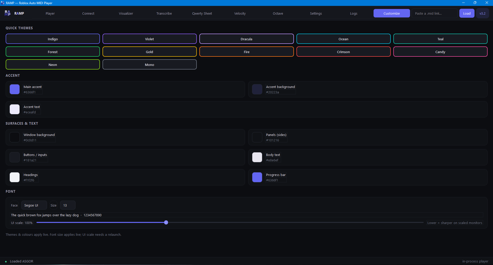
</div>
11 quick themes plus full control of every color, the font, and UI scale.
---
🛠️ Building from source
```
1. Install Python 3.13 from python.org (tick "Add to PATH")
2. Run Setup.bat          — installs dependencies
3. Run Start RAMP.bat     — run from source,  or
   Run build_exe.bat      — build your own RAMP.exe
4. Optional: Get_FluidSynth.bat — adds .sf2 soundfont support to your build
```
---
<div align="center">
Credits
Created by Tom — NanoInteractive · creator of Sonata Studios
Transcription models: Kong (ByteDance) · Transkun · Pop2Piano
Built with PySide6 (Qt) · mido · numpy · pynput · sounddevice · FluidSynth
</div>
